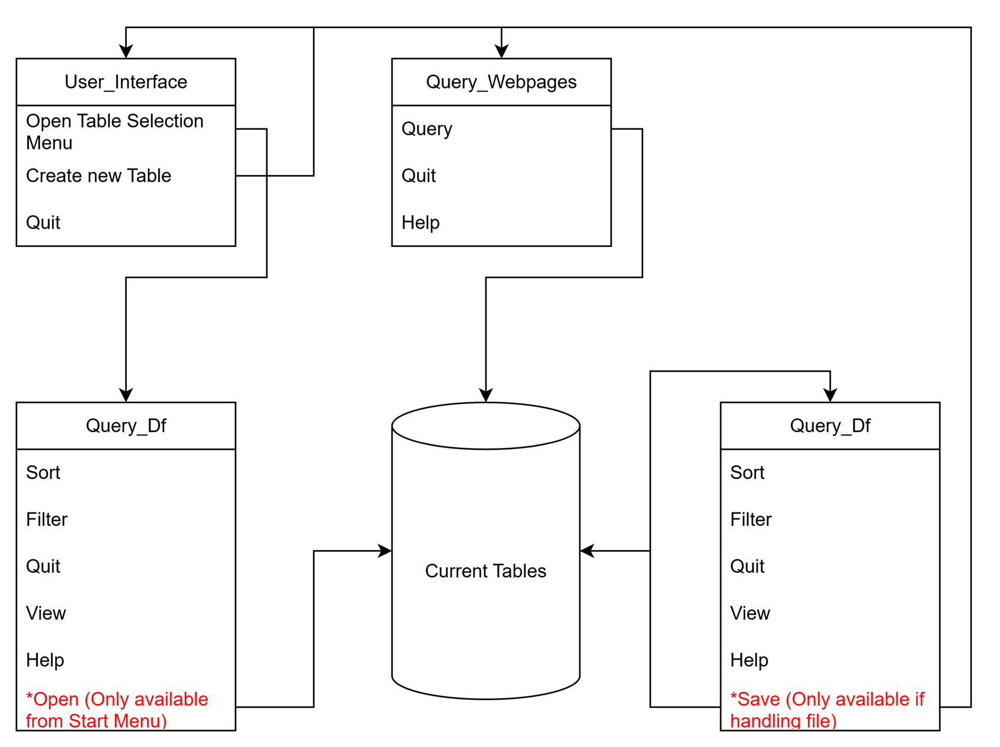

# Introduction

## Background
This program is designed to allow DIY auto mechanics the ability to browse prices from multiple auto mechanics webpages simultaneously. It relies upon web crawling as public API access is unavailable from most major auto parts manufacturers. 

## Purpose
The purpose of this document is to explain the architecture of the program and how it each aspect of the program interacts with each other. 

## Scope
This document describes the implementation of the Car Parts WebCrawler program. The program will consist of 4-5 major parts:
Local Pulling, Local Pushing, Local Terminal, and Web Terminal. Of the those listed most have been completed and are functional. At this time we are working to stabilize all aspects of the program and allow more seamless interaction. The program can fetch data both locally and remotely fairly well, it just needs better menu handoffs.

# System Components

## Decomposition Description
Mermaid Diagram:
    To be prepared.

The system relies upon 4 different files with several different classes / objects within. Inheritance is used to prevent code repetition. 

local_data_pull and local_data_push are groups of functions that are used to pull and push data from the records_keeping directory. 
local_terminal contains two objects User_Interface and Query_Df. Query_Df inherits from User_Interface. 

User_Interface is primarily a base class for other classes to inherit from. It is not called directly in any portion of the program, but instead inherited from.

The purpose of Query_Df is to create a pandas dataframe and allow for limited command line interface with that dataframe. There are two ways that Query_Df is used and the options available within it are tailored to each mode. The primary purpose of Query_Df is to pass a file from records_keeping into it and then tailoring the table to the users needs to save the car parts that meet the users criteria. The secondary purpose is to select a pre-existing query that meets the users needs. For instance if a table for a 2025 Ford F-150 front brakes query exists, and the user asks for that web query (and the query is sufficiently young), then the program will instead select the cached data... after this functionality is built. Alternatively the user can browse these selected tables instead of querying the web first.  

web_terminal is broken into two objects as Hollander and Web_Query. Hollander inherits from User_Interface and Web_Query. Web_Query like User_Interface is designed to be a class that is inherited from and not called upon directly. 

Hollander is fined tuned to the hollandercarparts.com webpage so that it can easily scrape the data needed from it to return to the user. So far it is functional but needs a little work to get closer to what the user wants. Right now it avoids heavy iteration as that will overload the website with requests and the goal is to make less requests to the website. This however causes more work for the end user.