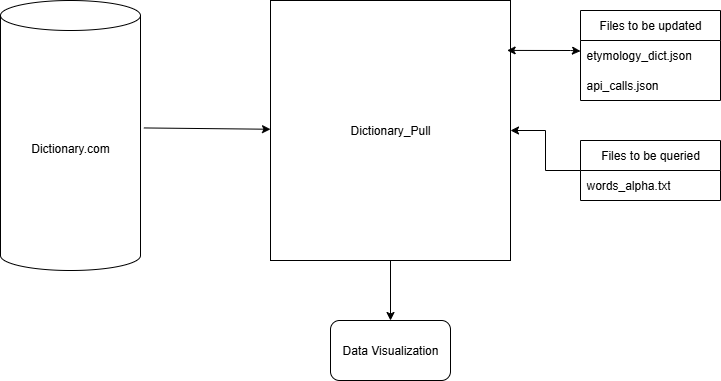
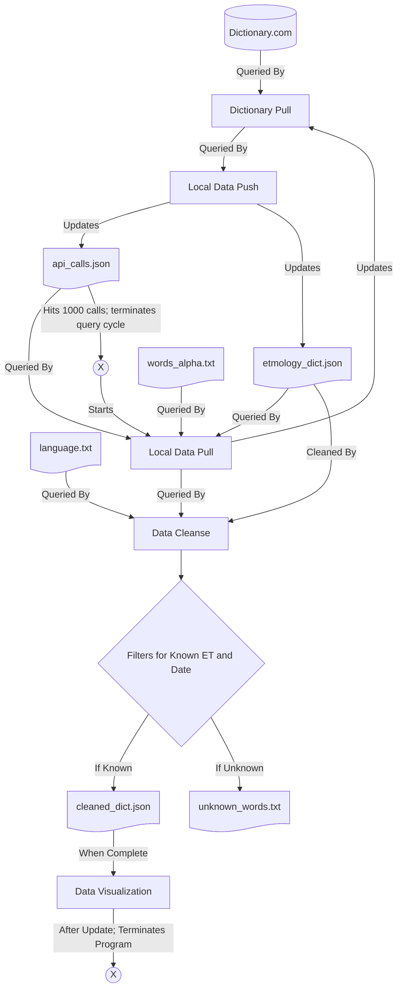

# Introduction

## Background
This program was designed with the goal of creating a data visualization of where words in the english language originate from. The first half of this project is to pull from dictionary.com via API using python and to draw the data and a JSON file to store the data. Once all the data is gathered locally and all words that are in the words_alpha.txt have been queried, the dataset will be complete (for now). As we wait for the data to arrive in full we will create a visualization of this data that can be viewed by end users.

## Purpose
The purpose of this document is to explain the architecture of the program and how it each aspect of the program interacts with each other. 

## Scope
This document describes the implementation of the Dictionary Analysis program. The program will consist of 4-5 major parts:
Database Pulling, Local Pulling, Local Pushing, and Data Visualization. Of the those listed 3 have been completed and function so far:
Database Pulling, Local Pulling, Local Pushing

# System Components

## Decomposition Description
Mermaid Diagram:

The system relies upon 6 python modules (dictioanary_pull, local_data_pull, local_data_push, data_cleansing, data_visualization) to interact with 1 database (dictionary.com) and 6 files (api_calls.json, cleaned_dict.json, etymology_dict.json, language.txt, unknown_words.txt, and word_alpha.txt) 
The process starts with local_data_pull pulling from etymology_dict.json to get the correct index point. 
Once the correct index point is retrieved, words_alpha.txt is read into local_data_pull as a list with and sliced so the start point is the word after the last word in etymology_dict.
From there this information is passed to dictionary_pull which then queries dictionary.com
After dictionary_pull receives a response, it makes sure it fits the criteria and conducts some rudimentary data cleaning. From this point, local data push updates api_calls.json and etymology_dict.json with the current count of api_calls and latest words. Once the dictioanary_pull object hits an api_call_count of 1000: the program terminates. If the program is attempted to start after the limit is met or exceeded, the program will check api_calls.json and self terminate.

After the program has finished querying dictionary.com for the day, the data cleansing python program will cleanse and filter the entire etymology_dict.json file from top to bottom. As the data cleansing process runs it filters words into those with unknown Origination Dates AND Etymologies, and those with known Origination Dates OR Etymologies. The former category has just it's word dumped into unknown_words.txt, the latter is pushed to etymology_dict.json. Later we will revisit the unknown words and see if there is any data to be capture there.

Once this process has completed the data visualization python program will then update the data_visualization file then terminate the entire program.

